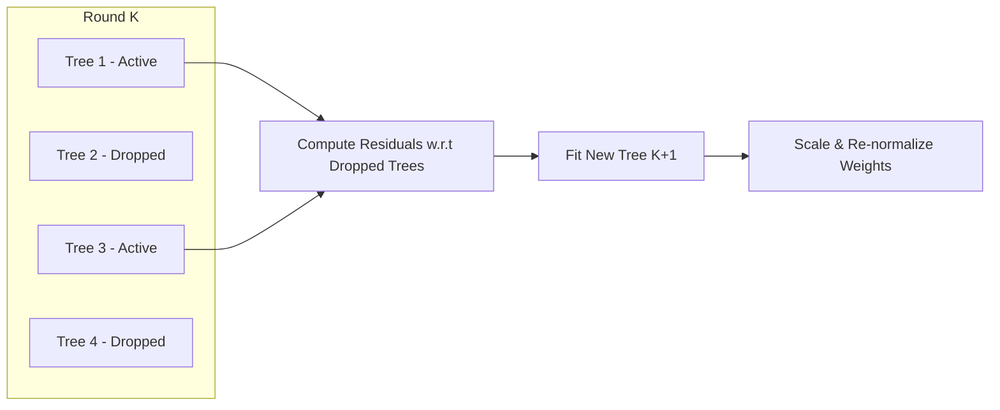

# DART Booster & Early Stopping

This document describes advanced boosting algorithms and training mechanisms in `xgboost-webgpu`, including the **DART Booster** (Dropouts meet Multiple Additive Regression Trees), **Early Stopping**, and **Training Continuation**.

---

## 1. DART: Dropouts meet Multiple Additive Regression Trees

Standard Gradient Boosted Decision Trees suffer from an inherent tendency toward **over-specialization**: trees constructed in early rounds dominate the predictions, while later trees only contribute minor corrections to niche residuals. This can lead to overfitting on noisy datasets.

**DART** introduces the deep learning concept of **dropout** into gradient boosting ensembles:



### The DART Algorithm
1. At boosting round $m$, a random subset $D \subset \{1, \dots, m-1\}$ of previously constructed trees is selected with dropout probability `rate_drop`.
2. With probability `skip_drop`, the dropout step is skipped entirely for that iteration, allowing standard gradient boosting to proceed.
3. The pseudo-residuals (gradients and Hessians) are computed against the ensemble **excluding the dropped trees**:
   $$\hat{y}_{-D} = \hat{y} - \sum_{j \in D} T_j(x)$$
4. A new tree $T_m$ is fit to these residuals.
5. The weights of the new tree and the dropped trees are scaled so the total ensemble expectation remains invariant:
   $$T_m \leftarrow \frac{1}{|D| + 1} T_m$$
   $$T_j \leftarrow \frac{|D|}{|D| + 1} T_j \quad (\forall j \in D)$$

### Usage in xgboost-webgpu
```rust
let params = BoosterParams::new()
    .with_booster_type(BoosterType::DART)
    .with_rate_drop(0.1) // 10% dropout rate
    .with_skip_drop(0.5); // 50% chance to skip dropout
```

---

## 2. Early Stopping

Training a GBDT for a fixed number of rounds risks underfitting (too few trees) or overfitting (too many trees). **Early Stopping** continuously monitors validation set performance and halts training when the metric stops improving for `early_stopping_rounds` consecutive rounds.

### Key Capabilities
* **Automatic Metric Tracking**: Monitors validation losses (`rmse`, `mae`, `logloss`, `error`).
* **Ensemble Truncation**: When training stops, the booster automatically prunes all trees constructed after `best_iteration`. The resulting model retains strictly the optimal checkpoint.
* **Metadata Export**: `bst.params.best_iteration` and `bst.params.best_score` are recorded and preserved when saving the model to JSON.

### Rust Example
```rust
let dtrain = DMatrix::from_dense(&x_train, 1000, 10, Some(&y_train), 256)?;
let dval = DMatrix::from_dense(&x_val, 200, 10, Some(&y_val), 256)?;

let params = BoosterParams::new()
    .with_objective("binary:logistic")
    .with_early_stopping(10)
    .with_eval_metric("logloss");

let booster = train(params, &dtrain, 200, &[(&dval, "validation")])?;
println!("Best Iteration: {:?}", booster.params.best_iteration);
println!("Best Score: {:?}", booster.params.best_score);
```

---

## 3. Training Continuation (`train_continue`)

In distributed pipelines, streaming workflows, or hyperparameter sweeps, it is often necessary to resume training an existing model without retraining from scratch:

```rust
// Train initial 20 trees
let mut booster = train(params, &dtrain, 20, &[])?;
assert_eq!(booster.num_trees(), 20);

// Resume training for 30 additional rounds (total 50 trees)
booster.train_continue(&dtrain, 30, &[])?;
assert_eq!(booster.num_trees(), 50);
```

The booster seamlessly updates margin accumulators, preserves all previously trained tree splits, and appends newly trained trees.
