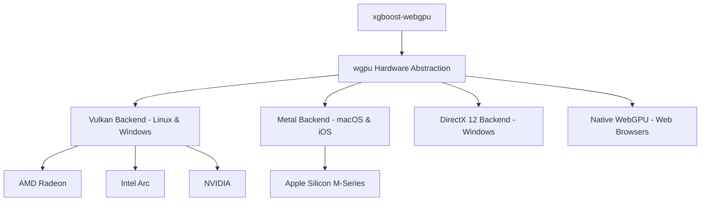
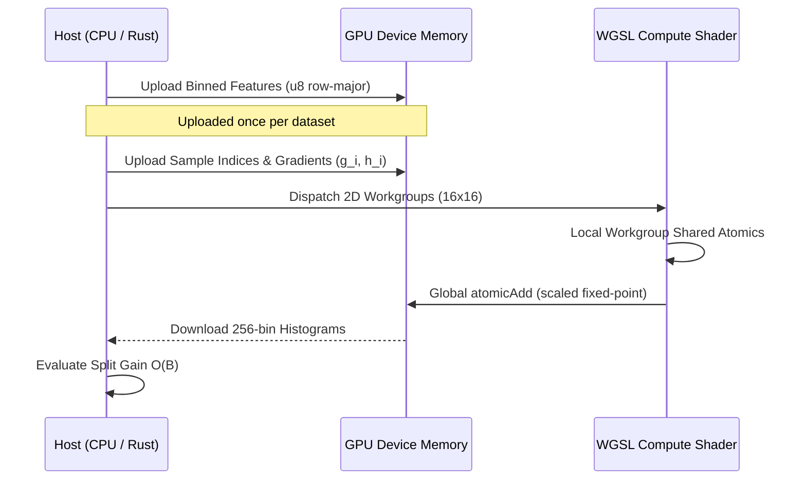

# Architecture & WebGPU Compute Pipeline

This document explains the technical architecture of `xgboost-webgpu`, detailing why WebGPU was chosen over WebGL and CUDA, how the WGSL compute pipeline works, and the novel techniques used to guarantee cross-vendor GPU execution.

---

## 1. Why WebGPU?

The primary challenge in writing a universal GPU-accelerated gradient boosting library is selecting a compute API that executes reliably across heterogeneous operating systems and hardware architectures without vendor lock-in.



### Detailed API Comparison

| Capability | Standard XGBoost (CUDA) | WebGL 2.0 | OpenCL | WebGPU (`xgboost-webgpu`) |
| :--- | :--- | :--- | :--- | :--- |
| **Vendor Support** | NVIDIA GPUs only | Universal | Fragmented drivers | **Universal (AMD, Apple, Intel, NVIDIA)** |
| **Compute Shaders** | Native PTX / C++ | ❌ None (graphics fragment only) | Dedicated kernels | **First-class compute (`@compute`, WGSL)** |
| **Storage Buffers** | Direct pointer access | ❌ Textures only (2D ping-pong) | Global memory buffers | **Storage buffers (`read_write`)** |
| **Atomic Writes** | Hardware atomics | ❌ No arbitrary atomic writes | Hardware atomics | **Atomic operations (`atomicAdd`)** |
| **Browser Execution**| ❌ Impossible | Emulated | ❌ Impossible | **Native WebAssembly execution** |
| **OS Support** | Linux / Windows | All | Broken on macOS (deprecated) | **Linux, macOS, Windows, iOS, Web** |

### Why WebGL 2.0 Was Rejected
WebGL 2.0 has no compute shaders and lacks arbitrary atomic write operations in shader stages. Building GBDT histograms in WebGL requires encoding gradients into 2D floating-point textures and performing multiple rendering passes (ping-pong reduction), which introduces prohibitive memory bandwidth and CPU-GPU synchronization bottlenecks.

---

## 2. GPU Histogram Construction Pipeline

In modern Gradient Boosted Decision Trees (Fast Hist / LightGBM / XGBoost `hist`), the computational bottleneck during tree building is **histogram construction**: accumulating first-order gradients ($G$) and second-order Hessians ($H$) for each quantized feature bin across active training samples in a node.

$$\text{Hist}[f, b] = \left( \sum_{i \in \text{Node}, \text{bin}(x_{i, f}) = b} g_i, \sum_{i \in \text{Node}, \text{bin}(x_{i, f}) = b} h_i \right)$$



---

## 3. The Universal Fixed-Point Atomic Scaling Technique

### The Challenge with WGSL Floating-Point Atomics
In WebGPU (WGSL), `atomic<f32>` is an optional feature (`shader-f32-atomic`) that is **not supported on the majority of hardware**, including many mobile GPUs, integrated graphics, and older desktop hardware. Standard `atomicAdd` in WGSL is only guaranteed for 32-bit signed integers (`i32`) and 32-bit unsigned integers (`u32`).

### The Solution: Dynamic Fixed-Point Quantization
To guarantee universal compatibility across every WebGPU device, `xgboost-webgpu` converts floating-point gradients ($g_i$) and Hessians ($h_i$) into scaled 32-bit integers inside the compute shader:

1. Gradients and Hessians are uploaded as standard 32-bit floats.
2. A configurable scaling constant ($S = 10^4$ or $10^5$) is passed via uniforms:
   $$\tilde{g}_i = \text{round}(g_i \cdot S)$$
   $$\tilde{h}_i = \text{round}(h_i \cdot S)$$
3. The WGSL shader accumulates these into `atomic<i32>` buffers:
   ```wgsl
   let scaled_g = i32(round(g * uniforms.scale_factor));
   let scaled_h = i32(round(h * uniforms.scale_factor));
   atomicAdd(&histograms[hist_idx].sum_g, scaled_g);
   atomicAdd(&histograms[hist_idx].sum_h, scaled_h);
   ```
4. Upon reading the histogram back to host memory, values are converted back to `f32`:
   $$G = \frac{\tilde{G}}{S}, \quad H = \frac{\tilde{H}}{S}$$

This approach guarantees bit-exact reproducible results across all vendors while avoiding floating-point race conditions.

---

## 4. Compact 256-Bin Quantization

Continuous floating-point features are pre-binned into $B = 256$ quantile buckets:
- Every feature value is represented as a single `u8` integer ($0 \le b < 256$).
- **Memory Footprint**: Reduces raw feature memory by **75%** compared to 32-bit floats (e.g. 10 million values consume 10 MB instead of 40 MB).
- **GPU Read Optimization**: In WGSL storage buffers, four consecutive feature bins are packed into a single 32-bit integer (`u32`), maximizing memory bus utilization.

---

## 5. Sibling Histogram Subtraction

During recursive tree growth, when a parent node splits into a left child and a right child:
$$\text{Hist}(\text{Parent}) = \text{Hist}(\text{Left}) + \text{Hist}(\text{Right})$$

Instead of executing two GPU histogram compute dispatches:
1. `xgboost-webgpu` identifies whether the Left child or Right child has fewer training samples:
   $$\text{Smaller} = \arg\min(|\text{Left}|, |\text{Right}|)$$
2. The GPU computes histograms **only for the smaller child**.
3. The sibling's histogram is computed in $O(B)$ time via simple subtraction:
   $$\text{Hist}(\text{Larger}) = \text{Hist}(\text{Parent}) - \text{Hist}(\text{Smaller})$$

This optimization cuts GPU compute time and VRAM bandwidth by up to **50%** per tree level.
