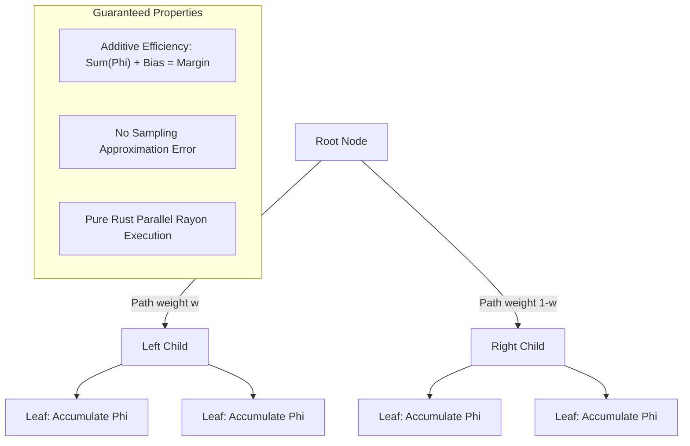

# Model Interpretability & TreeSHAP

`xgboost-webgpu` includes comprehensive model interpretability tools, offering both **global feature importance** metrics and **exact local explanations via TreeSHAP**.

---

## 1. Global Feature Importance

Feature importance metrics summarize how much each feature contributed to building the ensemble across all trees:

| Metric | Enum Variant | Description |
| :--- | :--- | :--- |
| **Weight** | `ImportanceType::Weight` | Frequency: The number of times a feature was selected to split a node across all trees. |
| **Gain** | `ImportanceType::Gain` | Average loss reduction (gain) contributed by splits involving this feature. |
| **Cover** | `ImportanceType::Cover` | Average sum of second-order Hessians (sample coverage) across splits involving this feature. |
| **TotalGain** | `ImportanceType::TotalGain` | The total cumulative gain across all splits involving this feature. |
| **TotalCover** | `ImportanceType::TotalCover` | The total cumulative Hessian coverage across all splits involving this feature. |

### Rust Example
```rust
let importance = booster.feature_importance(ImportanceType::Gain);
for (feat, gain_score) in importance {
    println!("Feature {}: Gain = {:.4}", feat, gain_score);
}
```

### Python Example
```python
# Returns dictionary of {feature_name: gain_score}
print(clf.feature_importances_)
```

---

## 2. Exact Local Explanations: TreeSHAP

While global feature importance ranks features across the whole dataset, **TreeSHAP** (Lundberg & Lee, *Nature Machine Intelligence* 2020) computes exact **local feature attributions** for each individual prediction.

### Mathematical Foundations
TreeSHAP computes the classical **Shapley values** from cooperative game theory efficiently on tree ensembles. For sample $i$, the model's raw prediction $\hat{y}_i$ is decomposed into individual feature contributions $\phi_{i, j}$ plus a global baseline bias $\phi_{\text{bias}}$:

$$\sum_{j=0}^{M-1} \phi_{i, j} + \phi_{\text{bias}} = \hat{y}_i$$

* **Efficiency Axiom**: The sum of feature attributions plus the expected value exactly equals the model prediction with zero residual error.
* **Symmetry Axiom**: Features contributing identically across all subsets receive identical attribution.
* **Dummy Axiom**: Features that never impact tree splits receive $\phi = 0$.

### Algorithmic Implementation in xgboost-webgpu
Standard KernelSHAP approximates Shapley values exponentially ($O(2^M)$). `xgboost-webgpu` implements the **exact polynomial-time TreeSHAP algorithm** ($O(T \cdot L \cdot D^2)$ where $T$ is the number of trees, $L$ is the number of leaves, and $D$ is the tree depth).



### Output Dimensions
Calling `predict_contributions(&dmatrix)` returns an $N \times (M + 1)$ matrix:
* Columns $0 \dots M-1$: The local Shapley attribution $\phi_{i, j}$ for feature $j$.
* Column $M$: The expected baseline score ($\phi_{\text{bias}}$).

### Rust Example
```rust
let contributions = booster.predict_contributions(&dtest)?;
for (i, sample_shap) in contributions.iter().enumerate() {
    let bias = sample_shap.last().unwrap();
    let feat_contribs = &sample_shap[..sample_shap.len() - 1];
    println!("Sample {}: bias = {}, attributions = {:?}", i, bias, feat_contribs);
}
```

### Python Example
```python
shap_values = clf.predict_contributions(X_test)
# Convert to numpy array: shape is (n_samples, n_features + 1)
import numpy as np
shap_arr = np.array(shap_values)
print("SHAP matrix shape:", shap_arr.shape)
```

---

## 3. Leaf Index Traversal (`predict_leaf`)

`xgboost-webgpu` provides direct access to the leaf indices traversed by each sample:

$$\mathbf{L}_i = [l_{i, 1}, l_{i, 2}, \dots, l_{i, T}]$$

Where $l_{i, t}$ is the index of the terminal leaf node in tree $t$ for sample $i$.

### Applications
* **Embedding Features**: Feeding leaf index vectors into linear models or neural networks (e.g. He et al., "Practical Lessons from Predicting Clicks on Facebook Ads").
* **Sample Clustering**: Measuring sample similarity by counting shared leaves across the forest.
