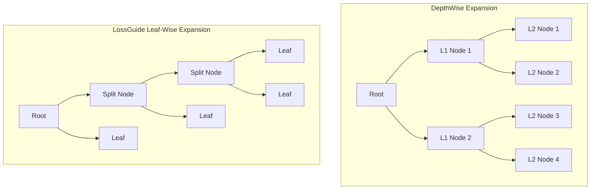

# Tree Growth & Policies

This document covers how decision trees are constructed in `xgboost-webgpu`, including optimal split search, leaf weight calculations, regularization, growth policies (`DepthWise` vs. `LossGuide`), subsampling, and monotonic/interaction constraints.

---

## 1. Optimal Split Finding & Gain Formula

At any node in a tree, let $I$ denote the set of sample indices at that node. The total gradient and Hessian sums are:
$$G = \sum_{i \in I} g_i, \quad H = \sum_{i \in I} h_i$$

When splitting candidate feature $f$ at bin threshold $b$, the samples are partitioned into $I_L$ (left child) and $I_R$ (right child), with corresponding sums $(G_L, H_L)$ and $(G_R, H_R)$.

The **gain (loss reduction)** of the proposed split is defined as:
$$\text{Gain} = \frac{1}{2} \left[ \frac{G_L^2}{H_L + \lambda} + \frac{G_R^2}{H_R + \lambda} - \frac{(G_L + G_R)^2}{H_L + H_R + \lambda} \right] - \gamma$$

Where:
* $\lambda$ (`reg_lambda`): $L_2$ regularization penalty on leaf weights.
* $\gamma$ (`gamma`): Minimum loss reduction required to justify making a partition. A split is only executed if $\text{Gain} > 0$.
* Split validity also requires: $H_L \ge \text{min\_child\_weight}$ and $H_R \ge \text{min\_child\_weight}$.

---

## 2. Leaf Weight Calculation with Regularization

When a node becomes terminal (a leaf), its optimal output weight $w^*$ minimizes the regularized second-order Taylor expansion:

$$w^* = - \frac{\text{sign}(G) \cdot \max(0, |G| - \alpha)}{H + \lambda}$$

Where:
* $\alpha$ (`reg_alpha`): $L_1$ regularization penalty (soft-thresholding).
* **Step Clamping (`max_delta_step`)**: When `max_delta_step > 0`, the maximum step size is bounded:
  $$w_{\text{clamped}} = \text{clamp}(w^*, -\delta_{\max}, +\delta_{\max})$$
  This stabilizes boosting in logistic regression with severe class imbalance.

---

## 3. Tree Growth Policies

`xgboost-webgpu` supports both industry-standard tree expansion paradigms:

### DepthWise (`GrowPolicy::DepthWise`)
* The traditional XGBoost strategy.
* Expands nodes level-by-level up to `max_depth`.
* Produces symmetric, balanced trees that generalize well on smaller datasets and reduce overfitting.

### LossGuide (`GrowPolicy::LossGuide`)
* The leaf-wise best-first strategy popularized by LightGBM.
* At each step, evaluates all active leaves and splits the single leaf that produces the **maximum loss reduction (gain)**.
* Continues until reaching `max_leaves` terminal nodes (or `max_depth` if specified).
* Achieves significantly lower loss with fewer leaves, especially on complex or large datasets.

---

## 4. Subsampling & Regularization

To prevent overfitting and inject stochastic gradient boosting diversity, `xgboost-webgpu` supports subsampling across both dimensions:

* **Row Subsampling (Bagging - `subsample`)**:
  * Randomly samples a fraction (e.g. $0.8$) of training rows without replacement at the start of each boosting round.
* **Column Subsampling by Tree (`colsample_bytree`)**:
  * Randomly subsamples features before constructing each tree.
* **Column Subsampling by Level (`colsample_bylevel`)**:
  * Resamples active features at each depth level.
* **Column Subsampling by Node (`colsample_bynode`)**:
  * Resamples active features at every individual split node.

---

## 5. Domain Constraints

### Monotonic Constraints (`monotone_constraints`)
In financial underwriting, insurance pricing, and healthcare, models frequently require guaranteed monotonic behavior with respect to specific features (e.g. higher credit score must never increase interest rate):
* `+1`: Monotonically increasing constraint ($x_1 \ge x_2 \implies \hat{y}(x_1) \ge \hat{y}(x_2)$).
* `-1`: Monotonically decreasing constraint ($x_1 \ge x_2 \implies \hat{y}(x_1) \le \hat{y}(x_2)$).
* `0`: Unconstrained.

`xgboost-webgpu` enforces monotonicity during tree building by recursively propagating bounded parent intervals $(w_{\min}, w_{\max})$ to child leaves.

### Feature Interaction Constraints (`interaction_constraints`)
Restricts which features are permitted to interact within the same decision tree branch. Features partitioned into separate constraint sets cannot appear together along any root-to-leaf path.
